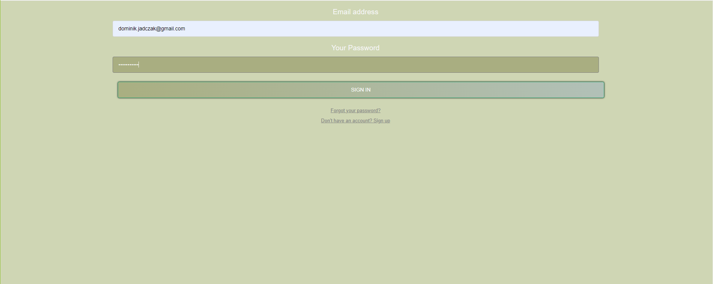
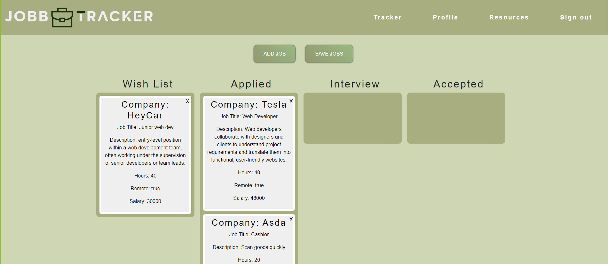
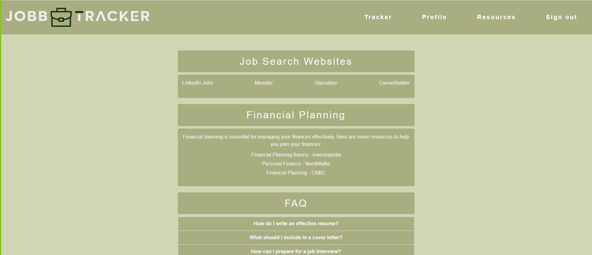
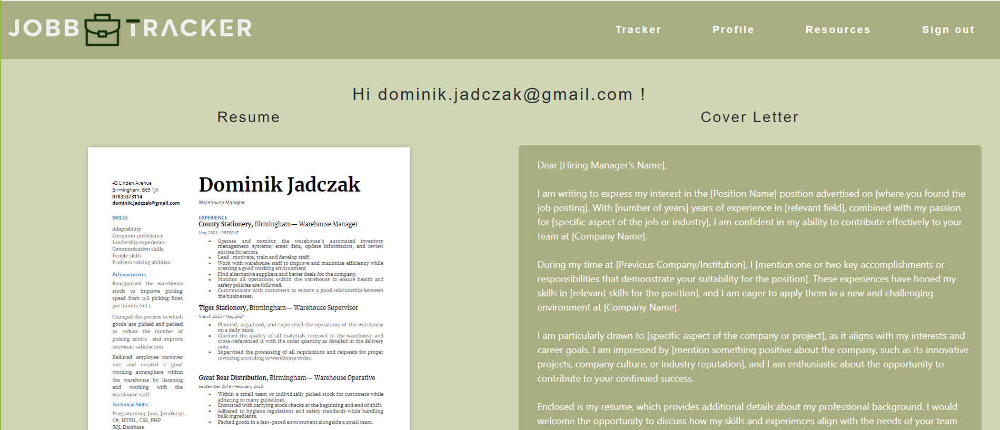

# Job Tracker Group Project

Welcome to the Job Tracker Group Project! This project is designed to help individuals or teams manage their job applications effectively.

## Table of Contents

- [Features](#features)
- [Installation](#installation)
- [Usage](#usage)
- [Demo Screenshots](#demo-screenshots)
- [Live Demo](#live-demo)
- [Contributors](#contributors)
- [License](#license)

## Features

- **Track Job Applications:** Keep track of the jobs you've applied to, including details like company name, position, application status, and deadlines.
- **Organize Job Details:** Store additional details about each job, such as company, salary location.
- **Personalised profile** Upload your CV and cover letter, with ability to edit and download them
- **Visualize Progress:** Visualize your application progress through intuitive drag and drop functionality .
- **Reource:** Access to articles to improve employability and FAQ's
- **Editable tracker:** Add and delete jobs as .

## Installation

To run this project locally, follow these steps:

1. Clone this repository to your local machine:
2. Install all dependenceies using "npm i"
3. Open the app on your device with "npm run dev"

## Usage 

- Sign up for an account or log in if you already have one.
- Add job listings by clicking on the "Add Job" button and filling in the required details.
- Upload your CV and cover letter on the profile page to make it readily availble 
- Update the application status of each job as your progress changes.
- Navigate to the resources page for helping tips and and articcles 

## Demo Screenshots 

## Live demo
 For a live demo of the web page [click here ](https://jobbtracker.netlify.app/)

## Contributors

**Dom Jadczak** [github](https://github.com/Dominik-Jad)

**Olumide Olayeni** [github](https://github.com/blackiechan48)

## License

This project is licensed under the *MIT License*.

